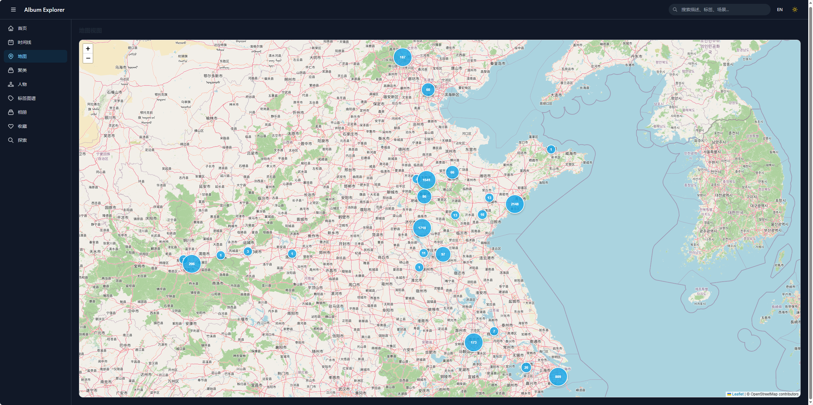
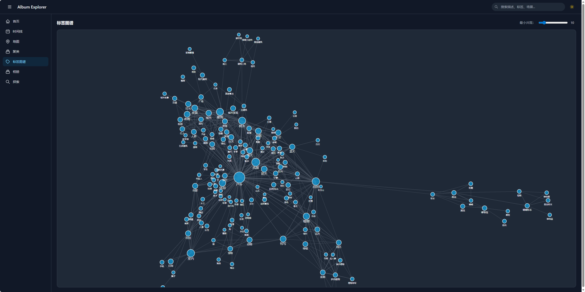

<p align="center">
  <a href="./README_en.md">English</a> | <span>简体中文</span>
</p>

<div align="center">

# Album Explorer

**相册语义浏览器 · 让每张照片都能被找到**

<p>
  <a href="https://opensource.org/licenses/MIT">
    
  </a>
  <a href="https://www.python.org/">
    
  </a>
  <a href="https://vuejs.org/">
    
  </a>
  <a href="https://github.com/SeanWong17/album-explorer/pulls">
    
  </a>
</p>


<p>
  
  
</p>

</div>

---

## 📋 项目简介

消费 [album-assetizer](https://github.com/SeanWong17/album-assetizer) 生成的图像语义数据，提供搜索、地图、聚类、时间线等多维度浏览体验。

```
album-assetizer 生成结构化数据 → album-explorer 可视化浏览
```

| 项目 | 说明 |
|------|------|
| [album-assetizer](https://github.com/SeanWong17/album-assetizer) | 上游数据管线：扫描图片 → EXIF 提取 → Vision LLM 标注 → 结构化数据 |
| **album-explorer**（本项目） | 下游可视化：消费标注数据，提供多维度浏览体验 |

---

## ✨ 核心特性

| 模块 | 功能描述 |
|------|----------|
| **首页推荐** | 最近拍摄、随机精选、热门主题、已保存搜索、热门地点多区块并列 |
| **时间线** | 按月分组，前 3 个月立即加载，其余懒加载 |
| **地图视图** | 城市聚合气泡 + 单点标记，点击打开详情 |
| **聚类相册** | HDBSCAN embedding 聚类，自动命名，支持手动封面 |
| **人物识别** | InsightFace 人脸检测 + embedding 聚类，支持命名/合并/删除/设置头像，GPU 加速 |
| **收藏功能** | 一键收藏/取消，独立收藏页面浏览 |
| **类型分类** | 自动识别截图、长图、动图，分类浏览 |
| **标签图谱** | D3 力导向图展示标签共现关系，节点按连接度着色 |
| **统一探索页** | 文本搜索 + 多维筛选 + 日历选择器，自适应铺满屏幕 |
| **全文搜索** | FTS5 覆盖描述、场景、标签、城市名 |
| **手动相册** | 创建/删除相册，添加/移出图片，批量操作 |
| **相似推荐** | 基于预计算 Top-K 邻居的即时相似推荐 + 当日图像 |
| **多语言** | 中英文界面一键切换，偏好自动记忆 |
| **暗色主题** | 一键切换，自动检测系统偏好 |

---

## 🚀 快速开始

### 环境要求

- Python 3.11+
- Node.js 18+
- 一份由 [album-assetizer](https://github.com/SeanWong17/album-assetizer) 生成的数据库

### 1. 配置

```bash
git clone https://github.com/SeanWong17/album-explorer.git
cd album-explorer
cp .env.example .env
# 编辑 .env，填入你的数据目录路径
```

### 2. 安装与启动

```bash
# 后端
cd backend
pip install -e .
uvicorn app.main:app --reload --port 8000

# 前端（另一个终端）
cd frontend
npm install
npm run dev
```

访问 http://localhost:3000

### 3. Docker 启动（可选）

```bash
ALBUM_EXPLORER_BASE=/path/to/your/album-data docker compose up
```

### 4. 数据处理任务（首次使用）

```bash
cd backend

# GPS 反查城市名（需要行政区划数据）
# git clone --depth 1 https://github.com/GaryBikini/ChinaAdminDivisonSHP.git data/china_shp
python -m tasks.reverse_geocode

# 批量生成缩略图
python -m tasks.generate_thumbnails --workers 4

# 生成 embedding 向量（需要 GPU）
pip install -e ".[ml]"
python -m tasks.generate_embeddings

# 执行聚类 + 构建标签图 + 预计算邻居 + 丰富聚类信息
python -m tasks.run_clustering
python -m tasks.build_tag_graph
python -m tasks.build_neighbors
python -m tasks.enrich_clusters

# 人脸检测（支持 GPU 加速，也可 Docker 运行）
python -m tasks.detect_faces --preload-workers 4

# 人脸聚类（生成人物分组，首次使用）
python -m tasks.cluster_faces

# 新增图片后增量分配人脸到已有人物（无需重新聚类）
python -m tasks.assign_new_faces --threshold 0.5
```

---

## 🛠️ 技术栈

| 层 | 技术 |
|----|------|
| 后端 | FastAPI + SQLite + aiosqlite + FTS5 |
| 前端 | Vue 3 + Vite + TailwindCSS + Pinia + Vue Router |
| 地图 | Leaflet + markercluster |
| 地理编码 | GeoPandas + 地级市 Shapefile |
| 聚类 | HDBSCAN + bge-small-zh-v1.5 |
| 人脸 | InsightFace (buffalo_l) + HDBSCAN + onnxruntime-gpu |
| 相似度 | cosine similarity 预计算 Top-K 邻居 |
| 图谱 | D3.js force layout |

---

## 🏗️ 项目结构

```
album-explorer/
├── backend/
│   ├── app/
│   │   ├── routers/          # API 路由
│   │   ├── services/         # 业务逻辑（查询构建、缩略图）
│   │   ├── database.py       # DB 连接 + FTS5 初始化
│   │   ├── models.py         # Pydantic 模型
│   │   └── main.py           # FastAPI 入口
│   └── tasks/                # 离线数据处理任务
├── frontend/
│   └── src/
│       ├── views/            # 页面组件
│       ├── components/       # 通用组件
│       ├── stores/           # Pinia 状态
│       ├── api/              # API 封装
│       └── router/           # 路由配置
├── docs/images/              # 项目截图
├── Dockerfile
├── Dockerfile.faces            # GPU 人脸检测镜像
├── docker-compose.yml
└── .env.example
```

---

## 🤝 参与贡献

欢迎提交 Issue 和 Pull Request，详见 [CONTRIBUTING.md](CONTRIBUTING.md)。

---

## 📄 License

[MIT](LICENSE)
