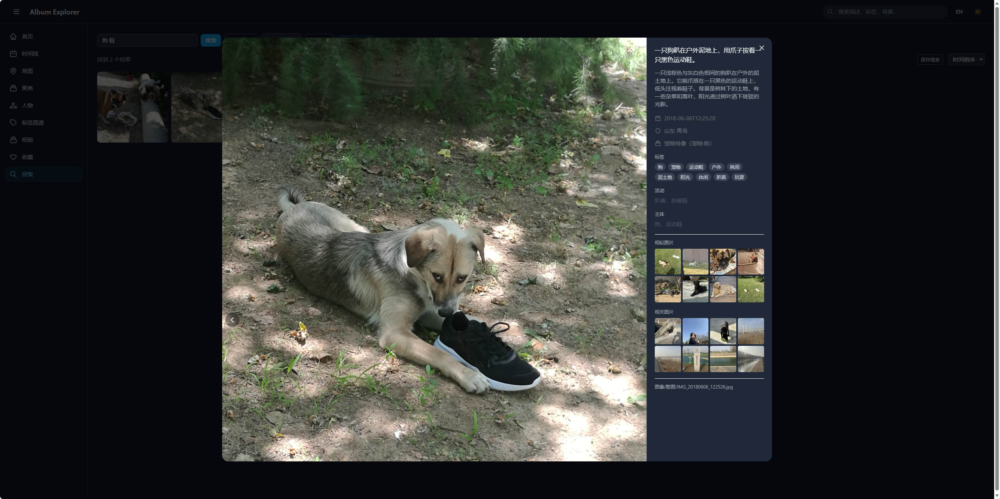

<p align="center">
  <span>English</span> | <a href="./README.md">简体中文</a>
</p>

<div align="center">

# Album Explorer

**Semantic Album Browser · Make every photo findable**

<p>
  <a href="https://opensource.org/licenses/MIT">
    
  </a>
  <a href="https://www.python.org/">
    
  </a>
  <a href="https://vuejs.org/">
    
  </a>
  <a href="https://github.com/SeanWong17/album-explorer/pulls">
    
  </a>
</p>



</div>

---

## 📋 Overview

Consumes semantic image data generated by [album-assetizer](https://github.com/SeanWong17/album-assetizer), providing a multi-dimensional browsing experience with search, maps, clustering, timeline and more.

```
album-assetizer generates structured data → album-explorer visualizes it
```

| Project | Description |
|---------|-------------|
| [album-assetizer](https://github.com/SeanWong17/album-assetizer) | Upstream pipeline: scan photos → EXIF extraction → Vision LLM annotation → structured data |
| **album-explorer** (this project) | Downstream visualization: browse, search, and explore the annotated data |

---

## ✨ Key Features

| Module | Description |
|--------|-------------|
| **Home Recommendations** | Recent photos, random picks, popular themes, saved searches, top locations |
| **Timeline** | Monthly groups, first 3 months eager-loaded, rest lazy-loaded on scroll |
| **Map View** | City-level cluster bubbles + individual markers, click to open details |
| **Cluster Albums** | HDBSCAN embedding clustering, auto-naming, manual cover selection |
| **Tag Graph** | D3 force-directed graph showing tag co-occurrence |
| **Explore Page** | Full-text search + multi-dimensional filters + calendar picker, adaptive grid |
| **Full-Text Search** | FTS5 covering descriptions, scenes, tags, city names |
| **Manual Albums** | Create/delete albums, add/remove photos, batch operations |
| **Similarity** | Pre-computed Top-K neighbors for instant recommendations + same-day photos |
| **Dark Mode** | One-click toggle, auto-detects system preference |

---

## 🚀 Quick Start

### Requirements

- Python 3.11+
- Node.js 18+
- A database generated by [album-assetizer](https://github.com/SeanWong17/album-assetizer)

### 1. Configure

```bash
git clone https://github.com/SeanWong17/album-explorer.git
cd album-explorer
cp .env.example .env
# Edit .env with your data directory paths
```

### 2. Install & Run

```bash
# Backend
cd backend
pip install -e .
uvicorn app.main:app --reload --port 8000

# Frontend (another terminal)
cd frontend
npm install
npm run dev
```

Visit http://localhost:3000

### 3. Docker (optional)

```bash
ALBUM_EXPLORER_BASE=/path/to/your/album-data docker compose up
```

### 4. Data Processing Tasks (first time)

```bash
cd backend

# Reverse geocode GPS to city names (requires admin division shapefile)
# git clone --depth 1 https://github.com/GaryBikini/ChinaAdminDivisonSHP.git data/china_shp
python -m tasks.reverse_geocode

# Generate thumbnails
python -m tasks.generate_thumbnails --workers 4

# Generate embedding vectors (GPU recommended)
pip install -e ".[ml]"
python -m tasks.generate_embeddings

# Clustering + tag graph + neighbors + cluster enrichment
python -m tasks.run_clustering
python -m tasks.build_tag_graph
python -m tasks.build_neighbors
python -m tasks.enrich_clusters
```

---

## 🛠️ Tech Stack

| Layer | Technology |
|-------|-----------|
| Backend | FastAPI + SQLite + aiosqlite + FTS5 |
| Frontend | Vue 3 + Vite + TailwindCSS + Pinia + Vue Router |
| Map | Leaflet + markercluster |
| Geocoding | GeoPandas + city-level Shapefile |
| Clustering | HDBSCAN + bge-small-zh-v1.5 |
| Similarity | Cosine similarity with pre-computed Top-K neighbors |
| Graph | D3.js force layout |

---

## 🏗️ Project Structure

```
album-explorer/
├── backend/
│   ├── app/
│   │   ├── routers/          # API routes
│   │   ├── services/         # Business logic (query builder, thumbnails)
│   │   ├── database.py       # DB connection + FTS5 initialization
│   │   ├── models.py         # Pydantic models
│   │   └── main.py           # FastAPI entry point
│   └── tasks/                # Offline data processing tasks
├── frontend/
│   └── src/
│       ├── views/            # Page components
│       ├── components/       # Shared components
│       ├── stores/           # Pinia stores
│       ├── api/              # API client
│       └── router/           # Route config
├── docs/images/              # Screenshots
├── Dockerfile
├── docker-compose.yml
└── .env.example
```

---

## 🤝 Contributing

Issues and Pull Requests are welcome. See [CONTRIBUTING.md](CONTRIBUTING.md) for details.

---

## 📄 License

[MIT](LICENSE)
